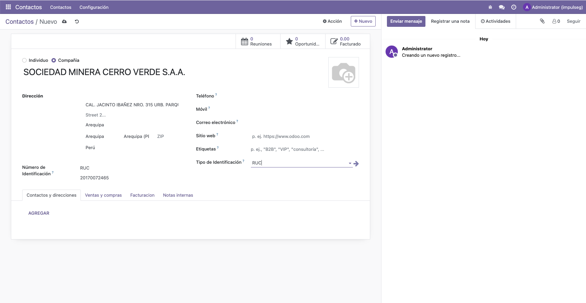
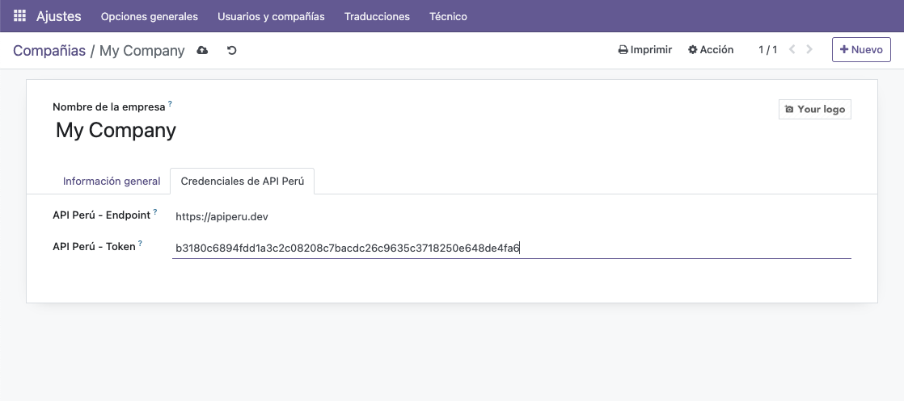

# Consulta SUNAT con API PERÚ

 


> **Facilita el autocompletado de datos empresariales y personales en res.partner utilizando la API PERÚ para consultas de RUC y DNI.**

## 🚀 Funcionalidades principales

- **Autocompletar información empresarial** al ingresar un número de RUC, incluyendo razón social, domicilio fiscal, departamento, provincia, y ubigeo.
- **Autocompletar nombres y apellidos completos** con el número de DNI.
- **Integración con API PERÚ** para obtener datos directamente de SUNAT.
- Ahorra tiempo y mejora la precisión de los datos ingresados en Odoo.
- Ideal para empresas peruanas que manejan grandes volúmenes de contactos.

## 📸 Capturas de pantalla

### Vista del formulario de contacto con la integración del módulo:



### Configuración del token de la API:



## 🔧 Instalación

1. Descarga o clona este repositorio en tu carpeta de módulos de Odoo:
    ```bash
    git clone https://github.com/juansalvador/consulta_sunat
    ```

2. Desde la interfaz de Odoo, ve a **Apps** > **Actualizar lista de aplicaciones**.
3. Busca "Consulta SUNAT con API PERÚ" e instálalo.
4. Configura tu token de API accediendo a **Ajustes** > **Empresas** > **Configurar token API**.

## 📘 Requisitos

- Odoo 17.0
- Python 3.x
- Módulo base de Odoo instalado (`base`)
- [API PERÚ](https://apiperu.dev/) token para las consultas de RUC y DNI

## 🛠 Uso

1. Ve al módulo de **Contactos** en Odoo.
2. Selecciona el tipo de identificación (RUC o DNI).
3. Ingresa el número de identificación en el campo correspondiente.
4. Automáticamente se completarán los datos relevantes (razón social, domicilio, nombres, etc.).

## 🧑‍💻 Autor

- **Juan Salvador**  
  Desarrollador full-stack y entusiasta de las integraciones con Odoo.  
  [jsalvador.dev](https://jsalvador.dev) | [GitHub](https://github.com/jsalvador-zsh)


